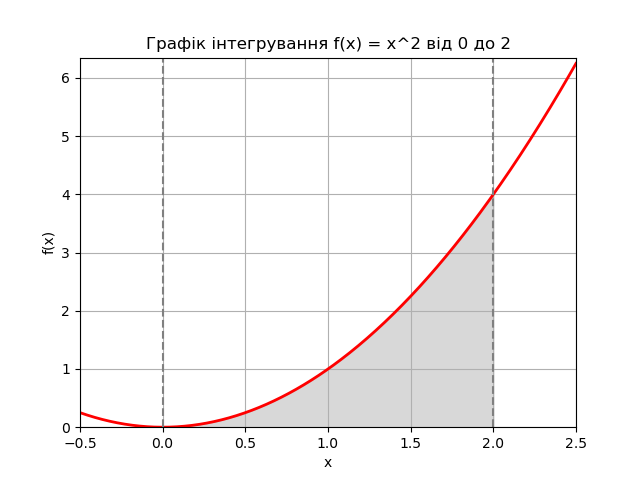

# Результати інтегрування
## Функція для інтегрування
Функція: f(x) = x^2
## Межі інтегрування
Нижня межа: 0
Верхня межа: 2
## Результати обчислень
- Результат методу Монте-Карло: 2.6753066273490074
- Точний результат (функція quad): 2.666666666666667
## Висновки
Метод Монте-Карло є наближеним і його точність залежить від кількості зразків. В даному випадку, різниця між результатами невелика.
При збільшенні кількості зразків до 100000 маємо наступні результати:
- Метод Монте-Карло: 2.64496944545883
- Точний результат (quad): 2.666666666666667
Отже, результат ніколи не буде абсолютно точним і може відрізнятися від аналітичного рішення.
## Графік функції

